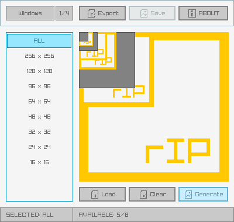

# rIconPacker

A simple and easy-to-use icons packer and extractor.

Pack/Unpack icon files, load icon and add new image sizes or just export icon images. 

rGuiIcons can be used for free as a [WebAssembly online tool](https://raylibtech.itch.io/riconpacker) and it can also be downloaded as a **standalone tool** for _Windows_ and _Linux_ with some extra features.

 

## rIconPacker Features

 - **Pack** your custom images into an icon
 - Input image formats supported: `.bmp`, `.png`, `.jpg` and `.qoi`
 - **Unpack** icon to check available image sizes
 - **Generate** missing icon sizes for selected platform
 - **Extract icon images** as PNG files
 - **4 predefined platforms: Windows, Favicon, Android, iOS**

### rIconPacker Standalone Additional Features

 - Command-line support for icons packing and extraction
 - Command-line supports configurable image scaling algorythm
 - **Completely portable (single-file, no-dependencies)**

## rIconPacker Screenshot

## rIconPacker Usage

Drag & drop your ICO/PNG files to unpack/add the different available image sizes, missing sizes could also be generated (using biggest available size).

`rIconPacker Standalone` comes with command-line support for batch conversion. For usage help:

 > riconpacker.exe --help

## rIconPacker License

`rIconPacker` online tool can be used completely for free.

`rIconPacker Standalone` desktop tool could be downloaded with a small donation. 

In any case, consider a donation to help the author keep working on software for games development.

*Copyright (c) 2015-2021 raylib technologies ([@raylibtech](https://twitter.com/raylibtech))*
